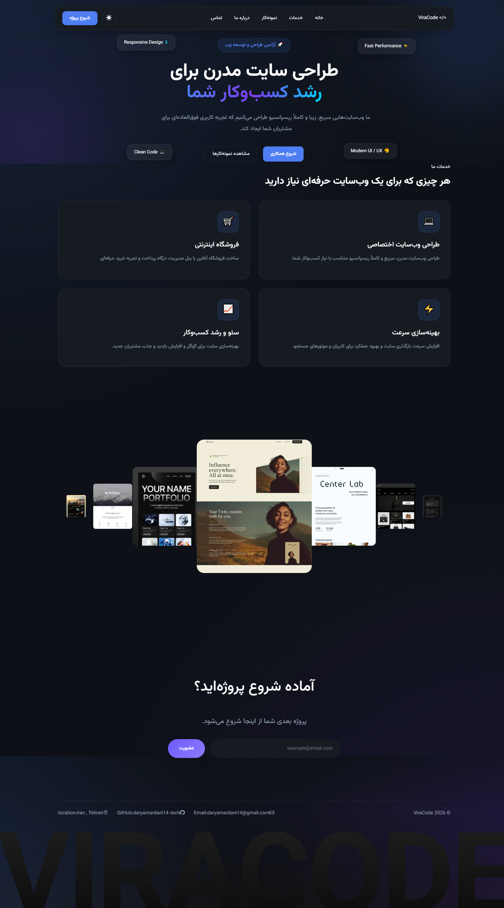

# ViraCode | Responsive Landing Page

A modern and responsive landing page built with HTML, CSS and JavaScript.

I created this project to practice front-end development and improve my skills in building responsive layouts, working with the DOM, using Bootstrap components, creating sliders with Swiper and adding interactive features with JavaScript.

---

## 🚀 Features

- Responsive Design
- Dark / Light Mode
- Mobile Navigation Menu
- Swiper Portfolio Slider
- Bootstrap Modal
- Form Validation
- Scroll Animations (AOS)
- Theme Preference Saved with LocalStorage

---

## 🛠 Built With

- HTML5
- CSS3
- JavaScript (ES6)
- Bootstrap 5
- Swiper.js
- AOS

---

## 📷 Preview



---

## 📂 Installation

Clone the repository:

```bash
git clone https://github.com/daryamardani14-tech/viracode-landing-page.git
```

Open the project folder and run `index.html` in your browser, or use Live Server in VS Code.

---

## 📚 What I Practiced

While building this project I practiced:

- Responsive Web Design
- DOM Manipulation
- Event Handling
- Form Validation
- LocalStorage
- Bootstrap Components
- Working with Third-Party Libraries
- Organizing Project Structure

---

## 👩‍💻 Author

**Darya**

GitHub: https://github.com/daryamardani14-tech
